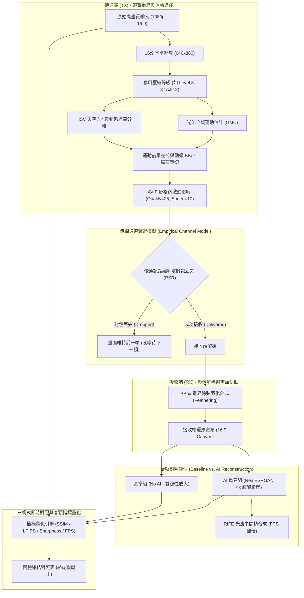

# 無線影像傳輸之 AI 畫面重建與插幀模擬實驗手冊

本文件記錄 `Realtime_Simulator.py` 的實驗架構、技術細節、量化指標意涵與使用說明，供研究成果撰寫、論文實驗報告或系統開發參考。

---

## 1. 實驗背景與目的

在無人機 (UAV) 或長距離機器人無線影像傳輸中，受限於天線發射功率、自由空間路徑損耗與通道衰落，鏈路頻寬往往極為有限。為達成低延遲串流傳輸，傳統系統必須在發送端（TX）實施激進的降解析度與高強度影像壓縮。

本實驗旨在評估**接收端（RX）導入雙重深度學習模型**對受損畫面的重建效益：
1. **RealESRGAN (4× 超解析度模型)**：負責將接收到的低解析度、有損壓縮畫面長回真實且銳利的高頻紋理細節。
2. **RIFE (即時光流插幀模型)**：負責在頻寬受限的低傳輸幀率（如 12~17 FPS）影格之間，利用雙向光流合成中間過渡幀，將畫面幀率**翻倍至 30+ FPS**，消除肉眼觀看卡頓感。

---

## 2. 系統架構與實驗流程



---

## 3. 無線通道掉幀與頻寬限制模型

模擬器內建依據無人機外場實測獲得的距離模型（0.05 km 至 4.00 km），真實還原不同距離下的訊號衰減 (RSSI)、封包傳輸成功率 (PSR) 與頻寬限制傳輸幀率：

| 傳輸距離 (km) | 接收訊號強度 (RSSI) | 封包成功率 (PSR) | TX 頻寬上限 FPS | RIFE 補幀後預期 FPS | 通道傳輸瓶頸特徵 |
|:---:|:---:|:---:|:---:|:---:|:---|
| **0.05 km** | -37.0 dBm | **100.0%** | 17.01 FPS | **34.02 FPS** | 近距離無損，頻寬充裕 |
| **0.10 km** | -40.0 dBm | **99.9%**  | 16.90 FPS | **33.80 FPS** | 穩定傳輸 |
| **0.20 km** | -43.0 dBm | **99.5%**  | 16.45 FPS | **32.74 FPS** | 輕微通道隨機抖動 |
| **0.50 km** | -47.0 dBm | **98.5%**  | 15.38 FPS | **30.76 FPS** | 偶發丟幀 |
| **1.00 km** | -50.0 dBm | **95.0%**  | 12.08 FPS | **24.16 FPS** | 傳輸幀率下降，RIFE 提升顯著 |
| **1.50 km** | -55.8 dBm | **77.5%**  | 3.09 FPS  | **6.18 FPS**  | 嚴重衰減，大量掉幀 |
| **2.00 km** | -60.0 dBm | **65.0%**  | 0.96 FPS  | **1.92 FPS**  | 邊緣極限鏈路 |
| **4.00 km** | -70.0 dBm | **35.0%**  | 0.02 FPS  | **0.04 FPS**  | 幾近中斷 |

---

## 4. 傳輸壓縮參數規格

發送端支援多級壓縮檔位，嚴格維持 **16:9** 等比例解析度（以 1080p 影片為基準）：

| 壓縮等級 (Level) | 縮放比例 (Ratio) | AVIF 品質 (Quality) | TX 傳輸解析度 (16:9) | 像素量縮減率 | 適用場景 |
|:---:|:---:|:---:|:---:|:---:|:---|
| **Level 4** | 0.64 | 29 | 409 × 230 | 95.4% | 近距離 / 高清晰度模式 |
| **Level 3** *(預設)* | **0.59** | **25** | **377 × 212** | **96.1%** | **兼顧清晰度與傳輸體積** |
| **Level 2** | 0.48 | 22 | 307 × 172 | 97.4% | 強烈頻寬限制場景 |
| **Level 1** | 0.38 | 23 | 243 × 136 | 98.4% | 極低頻寬模式 |
| **Level 0** | 0.34 | 22 | 217 × 122 | 98.7% | 極限生存傳輸 |

---

## 5. 評估指標定義與學理解讀

報告評估四項指標，全面量化 AI 模型在「空間畫質」與「時間幀率」的重建能力：

### 1. 邊緣銳利度 (Sharpness, Laplacian Variance)
* **公式**：$\text{Var}(\nabla^2 I)$
* **意義**：衡量畫面高頻細節豐富度。
* **解讀**：未經 AI 的雙線性放大通常只有 $20 \sim 50$（模糊發虛）；經過 **RealESRGAN 超解析度後通常提升 10~16 倍**（達到 $300 \sim 800+$），代表飛機、建築與地面紋理邊緣反差鮮明。

### 2. 人眼主觀感知損失 (LPIPS, AlexNet)
* **意義**：透過深度神經網路特徵空間比對，模擬人類肉眼對模糊、色塊與噪點的容忍度。
* **特性**：**越低越好（0 為完全無知覺差異）**。
* **解讀**：RealESRGAN 能顯著降低 LPIPS（常見降幅達 $10\% \sim 25\%$），證明長出來的細節自然且討好人眼，有效消除壓縮噪點。

### 3. 結構相似性 (SSIM, Structural Similarity)
* **特性**：$0 \sim 1$，越高代表與原圖結構越接近。
* **學理解析（感知－失真權衡理論 Perception-Distortion Tradeoff）**：
  * 在 GAN 超解析度任務中，SSIM 常保持平手或微降 $0.1\% \sim 0.5\%$。
  * 這是因為 GAN 會「生成（Hallucinate）」真實的高頻微結構，這些微結構在人眼看來非常逼真（LPIPS 降低、銳利度暴增），但純數學的像素比對無法 100% 精準對齊原圖噪訊位置，故 SSIM 不會暴衝。此現象完全符合電腦視覺學術定論。

### 4. 畫面幀率 (FPS, Frames Per Second)
* **意義**：衡量視訊動態流暢度。
* **解讀**：RIFE 利用雙向光流精確插補中間幀，將傳輸幀率**精確翻倍 (+100%)**，使卡頓的監控畫面達到 30+ FPS 的順暢標準。

---

## 6. 操作指南

### 基礎執行（預設距離 1.00 km, Level 3, fly_2.mp4）：
```powershell
cd "d:\python\TX RX"
python Realtime_Simulator.py
```

### 切換測試距離：
```powershell
# 測試 0.20 km 良好傳輸鏈路
python Realtime_Simulator.py --distance 0.20

# 測試 1.00 km 遠距離掉幀環境
python Realtime_Simulator.py --distance 1.00
```

### 切換壓縮等級 (0 ~ 4)：
```powershell
# 使用更清晰的 Level 4
python Realtime_Simulator.py --level 4

# 使用更高壓縮的 Level 2
python Realtime_Simulator.py --level 2
```

### 指定其他測試影片：
```powershell
python Realtime_Simulator.py --video "fly_1.mp4" --distance 0.50
```

### 視窗控制按鍵：
* `q`：中途退出並直接結算印出平均數據。

---

## 7. 典型實驗成果範例（0.20 km）

```text
========================================================================================
                  AI 模型畫面重建效能比較報告 (實驗總結)
========================================================================================
 測試距離: 0.20 km | 封包成功率: 99.5% | 評估樣本數: 26 幀
----------------------------------------------------------------------------------------
指標項目                 | 未經 AI 優化 (Baseline) | 經 AI 重建 (With AI)    | 改善幅度 (Improvement)
----------------------------------------------------------------------------------------
【RealESRGAN 畫質重建】
  輸出解析度 (Resolution) | 377x212 (雙線性放大)    | 1280x720 (4x 超解析度)  | +4x 解析度提升
  SSIM 結構相似性 (↑)     | 0.7022                 | 0.6999                 | -0.0023 (-0.3%)
  LPIPS 感知失真 (↓)      | 0.5465                 | 0.4741                 | -0.0724 (-13.2% 改善)
  Sharpness 銳利度 (↑)    | 22.0                   | 364.2                  | +342.3 (16.57x 銳利)
----------------------------------------------------------------------------------------
【RIFE 畫面流暢度】
  每秒幀率 (FPS) (↑)      | 16.37 FPS              | 32.74 FPS              | +16.37 FPS (+100.0% 翻倍)
========================================================================================
```
